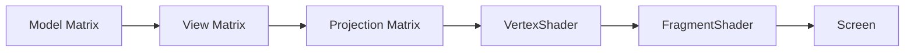
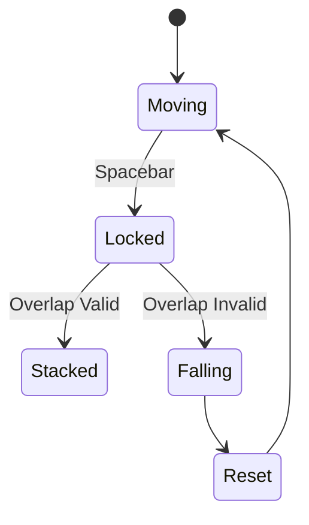

# 🧊 3D Stacker Game
**Course:** CSL7450 – Computer Graphics  
**Author:** Mohit Meemrauth  

---

## Overview

3D Stacker Game is an OpenGL-based interactive application that demonstrates core Computer Graphics concepts:

- 3D translation and transformations
- Camera and view matrix
- Perspective projection
- Collision detection
- Real-time state management

The objective is to stack horizontally moving cubes vertically. If the cube lands at least partially on the previous cube, it is stacked. If it completely misses, it falls and the game resets.

---

## Gameplay

- The active cube moves horizontally in a sine-wave motion.
- Press **Spacebar** to lock the cube in place.
- Partial overlap: stack continues.
- Complete miss: failure animation and reset.
- Score: number of stacked cubes.

---

## Core Logic

**Collision Rule:**

Let $d = |\text{ActiveX} - \text{PreviousX}|$

- If $d \leq \text{CubeWidth}$ → Valid stack
- If $d > \text{CubeWidth}$ → Failure

Any overlap is accepted.

---

## System Architecture

### High-Level Flow

```mermaid
flowchart TD
    A[GLFW Window Initialization] --> B[OpenGL Context Creation]
    B --> C[Shader Compilation]
    C --> D[Buffer Setup (VAO, VBO, EBO)]
    D --> E[Main Game Loop]
    E --> F[Input Handling]
    E --> G[Update Game State]
    E --> H[Collision Check]
    E --> I[Apply Transformations]
    E --> J[Render Scene]
    J --> E
```

---

### Rendering Pipeline



---

### Game State Flow



---

## Project Structure

```
3d-stacker-game/
│
├── stackers.py              # Main application file
├── shaders/
│   ├── basic.vert           # Vertex shader
│   └── basic.frag           # Fragment shader
│
├── README.md
└── requirements.txt
```

---

## Requirements

- Python 3.9+
- OpenGL 4.1 Core Profile
- GLFW
- PyOpenGL
- Pyrr
- NumPy

---

## Installation

Clone the repository:
```bash
git clone https://github.com/Mohi1038/3d-stackers-game.git
cd 3d-stackers-game
```

Create a virtual environment (recommended):
```bash
python3 -m venv venv
source venv/bin/activate  # On Windows: venv\Scripts\activate
```

Install dependencies:
```bash
pip install glfw PyOpenGL pyrr numpy
# or
pip install -r requirements.txt
```

---

## Running the Application

```bash
python stackers.py
```

---

## Controls

| Key        | Action              |
|------------|--------------------|
| Spacebar   | Lock / Drop Cube   |
| Close Window | Exit Game        |

---

## Rendering & Transformation

- **Model Matrix:** Translates cubes in 3D space (X: horizontal, Y: stack height, Z: depth)
- **View Matrix:** Camera dynamically adjusts height for stack visibility
- **Projection Matrix:** Perspective projection for depth realism

---

## Features

- Sine-wave dynamic cube movement
- Translation matrix positioning
- Distance-based partial overlap logic
- Failure detection with vertical drop animation
- Dynamic camera tracking
- Perspective projection
- Score HUD

---

## Possible Enhancements

- Dynamic cube trimming (real stacker behavior)
- Increasing difficulty (speed scaling)
- Sound effects
- Textured cubes
- Lives system

---

## Academic Context

This project demonstrates:
- Model-View-Projection pipeline
- Real-time rendering loop
- Transformation matrices
- Geometric collision detection
- OpenGL state management

---

## Conclusion

The 3D Stacker Game integrates mathematical modeling and graphical rendering into an interactive application, strictly using transformation-based logic without a physics engine. It aligns with the learning objectives of CSL7450 – Computer Graphics.
