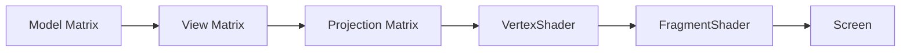
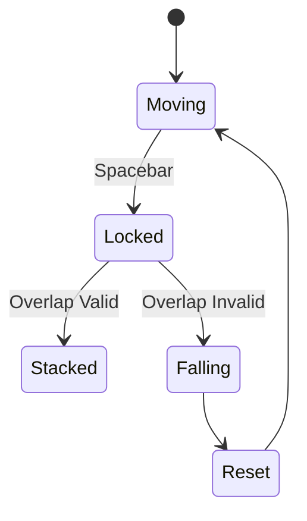

# 🧊 3D Stacker Game
**Course:** CSL7450 – Computer Graphics  
**Author:** Mohit Meemrauth  

---

## 📖 Overview

3D Stacker Game is an OpenGL-based interactive application that demonstrates core Computer Graphics concepts including:

- 3D Translation Transformations
- View Matrix (Camera System)
- Perspective Projection
- Distance-Based Collision Detection
- Real-Time State Management

The objective is to stack horizontally moving cubes vertically.  
If the cube lands at least partially on the previous cube, it is stacked.  
If it completely misses, it falls and the game resets.

The implementation strictly uses geometric logic — no physics engine is involved.

---

# 🎮 Gameplay Summary

- Active cube moves horizontally using sine-wave motion.
- Press **Spacebar** to lock the cube.
- Partial overlap → Stack continues.
- Complete miss → Failure animation + reset.
- Score = Number of stacked cubes.

---

# 🧠 Core Logic

### Collision Rule

Let:

```
d = |ActiveX - PreviousX|
```

If:

```
d ≤ CubeWidth  →  Valid Stack
d > CubeWidth  →  Failure
```

This guarantees that even minimal overlap is accepted.

---

# 🏗️ System Architecture

## High-Level Architecture

```mermaid
flowchart TD
    A[GLFW Window Initialization] --> B[OpenGL Context Creation]
    B --> C[Shader Compilation]
    C --> D[Buffer Setup (VAO, VBO, EBO)]
    D --> E[Main Game Loop]

    E --> F[Input Handling]
    E --> G[Update Game State]
    E --> H[Collision Check]
    E --> I[Apply Transformations]
    E --> J[Render Scene]
    J --> E
```

---

## Rendering Pipeline



---

## Game State Flow



---

# 📂 Project Structure

```
3d-stacker-game/
│
├── stackers.py              # Main application file
├── shaders/
│   ├── basic.vert           # Vertex shader
│   └── basic.frag           # Fragment shader
│
├── README.md
└── requirements.txt (optional)
```

---

# ⚙️ Requirements

- Python 3.9+
- OpenGL 4.1 Core Profile
- GLFW
- PyOpenGL
- Pyrr
- NumPy

---

# 🚀 Installation Guide

## 1️⃣ Clone Repository

```bash
git clone https://github.com/Mohi1038/3d-stackers-game.git
cd 3d-stackers-game
```

---

## 2️⃣ Create Virtual Environment (Recommended)

### macOS / Linux
```bash
python3 -m venv venv
source venv/bin/activate
```

### Windows
```bash
python -m venv venv
venv\Scripts\activate
```

---

## 3️⃣ Install Dependencies

```bash
pip install glfw PyOpenGL pyrr numpy
```

(Optional)
```bash
pip install -r requirements.txt
```

---

# ▶️ Running the Application

```bash
python stackers.py
```

Ensure:

- The `shaders/` folder exists.
- `basic.vert` and `basic.frag` are present.

---

# 🎥 Controls

| Key        | Action              |
|------------|--------------------|
| Spacebar   | Lock / Drop Cube   |
| Close Window | Exit Game        |

---

# 🎨 Rendering & Transformation Details

### Model Matrix
Used to translate cubes in 3D space:
- X → Horizontal movement
- Y → Stack height
- Z → Depth alignment

### View Matrix
Camera dynamically adjusts height:
```
CameraHeight = BaseHeight + (Layer * ScaleFactor)
```

Ensures full stack visibility.

### Projection Matrix
Perspective projection:
```
Perspective(FOV, AspectRatio, Near, Far)
```

Creates depth realism.

---

# 📊 Features Implemented

- ✔ Sine-wave dynamic cube movement
- ✔ Translation matrix positioning
- ✔ Distance-based partial overlap logic
- ✔ Failure detection with vertical drop animation
- ✔ Dynamic camera tracking
- ✔ Perspective projection
- ✔ Score HUD

---

# 🛠️ Troubleshooting

### Shader Compilation Error
Ensure:
- OpenGL 4.1 Core Profile is supported.
- Shader files are correctly located.

### macOS Issues
macOS requires:
```
glfw.window_hint(glfw.OPENGL_FORWARD_COMPAT, GL_TRUE)
```

### Black Screen
Check:
- Depth testing enabled
- Shader compiled successfully
- VAO created before buffer binding

---

# 📈 Possible Enhancements

- Dynamic cube trimming (real stacker behavior)
- Increasing difficulty (speed scaling)
- Sound effects
- Textured cubes
- Lives system

---

# 📜 Academic Context

This project demonstrates practical implementation of:

- Model-View-Projection pipeline
- Real-time rendering loop
- Transformation matrices
- Geometric collision detection
- OpenGL state management

---

# 📌 Conclusion

The 3D Stacker Game successfully integrates mathematical modeling and graphical rendering into an interactive application. The project strictly adheres to transformation-based logic without relying on physics engines, aligning with the learning objectives of CSL7450 – Computer Graphics.
